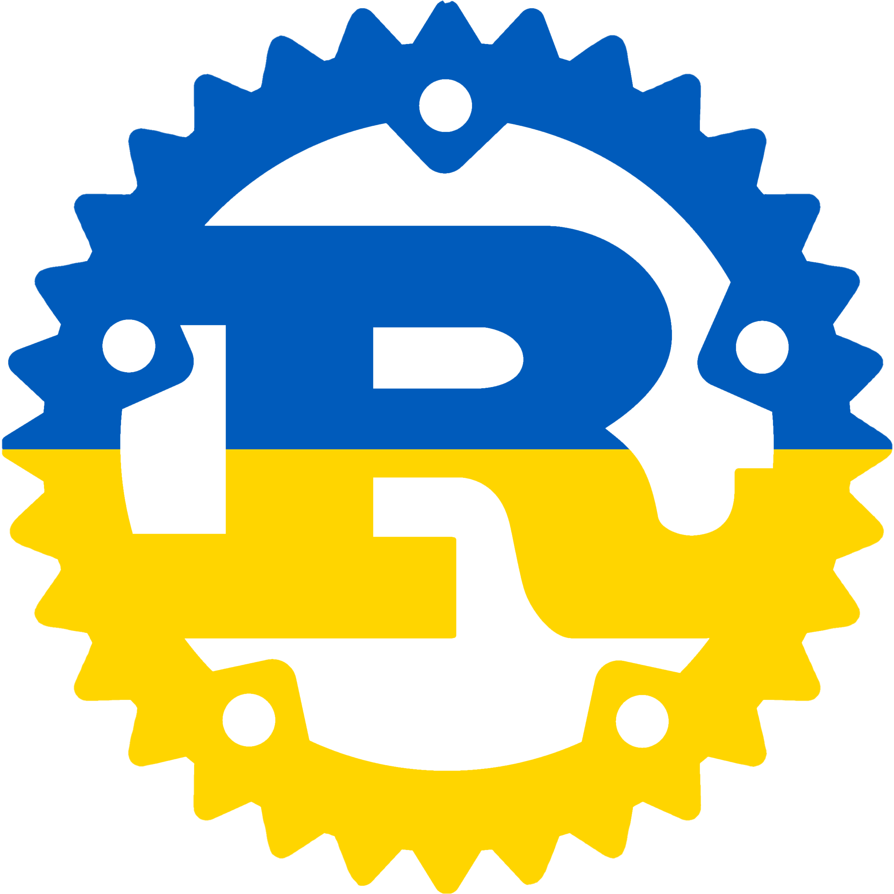

# Іржа



Чи ти не _втомився_ від написання Rust програм англійською? Чи ти бажаешь часто казати
"лайно" або "дідько"? Бажаєш чи ти спробувати щось інше, на єкзотичному та чудернацько звучній мові? Чи бажаешь ти привнести українській дотик до твоїх програм?

**Іржа** (це _Rust_ українською) тут щоб зробити тобі день, так як він дозволяє тобі писати Rust на українській, вживаючи українські ключові слова, українські назви функцій,
українські ідіоми.

Ця мова була спроектована для використання як офіційна мова програмування для розробки майбутньої незалежної операційної системи України.

Ось приклад того що можна бути досягнути з іржою:

### `конвенція` та `реалізація` (a.k.a. `trait` and `impl`)

```rust
irzha::irzha! {
    вжити std::collections::Словник як Слов;

    конвенція КлючЗначення {
        функція записати(&власний, ключ: Строка, значення: Строка);
        функція отримати(&власний, ключ: Строка) -> Результат<Можливо<&Строка>, Строка>;
    }

    статичний змінний СЛОВНИК: Можливо<Слов<Строка, Строка>> = Нічого;

    структура Конкретний;

    реалізація КлючЗначення для Конкретний {
        функція записати(&власний, ключ: Строка, значення: Строка) {
            нехай слов = небезпечно {
                СЛОВНИК.отримати_або_вставити_із(Default::default)
            };
            слов.вставити(ключ, значення);
        }
        функція отримати(&власний, ключ: Строка) -> Результат<Можливо<&Строка>, Строка> {
            якщо нехай Дещо(слов) = небезпечно { СЛОВНИК.як_посилання() } {
                Файно(слов.отримати(&ключ))
            } інакше {
                Хиба("перевірте словник".до())
            }
        }
    }
}
```

### Альтернативний синтаксис

```rust
#[дозволити(недоступний_код)]
функція побічна() {
    лайно!("о ні!"); // for the true Ukrainian experience
    дідько!("ну що за люди");
    халепа!("корову вкрали"); // in SFW contexts
}
```

### Інші приклади

Дивиться [приклади](https://github.com/brokeyourbike/irzha/blob/main/examples/src/main.rs) щоб мати призлизну думку про увесь сінтаксіс.

## contributors

First of all, _вельми дякую_ for considering participating to this joke, the
Ukrainian government will thank you later! Feel free to throw in a few identifiers
here and there, and open a pull-request against the `main` branch.

Please don't introduce swear words, though.

## but _нащо_ would you do that

- _Задля забави_
- playing with raw proc macros
- making a bit of fun about programming languages that do this seriously, though I can see their utility

## Інші мови

Дивиться [оригінальний пост](https://github.com/bnjbvr/rouille#other-languages) для отримання більш актуального списку.

## Дякую

[@bnjbvr](https://github.com/bnjbvr) за ідею, а також за базову репу

## Ліцензія

[WTFPL](https://github.com/brokeyourbike/irzha/blob/main/LICENSE)
